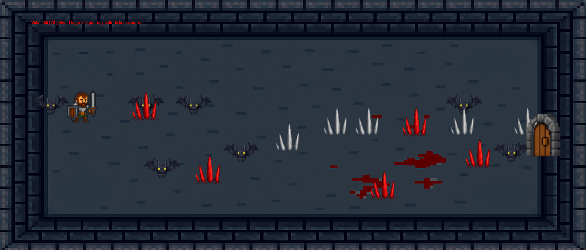

# Heroe de la mazmorra

## Equipo de desarrollo

- Juan Manuel Rohr

## Capturas

## Reglas de Juego / Instrucciones

. Ayuda al Heroe de la mazmorra a salir de ella, vas a tener que cuidarte de los murcielagos qeu te acechan de picos que sobresalen del suelo
algunos normales y otros volcanicos 🔥

Ah se me olvidaba! el escenario cambia cada vez que te dañan y deberias tener cuidado con las ilusiones, nuestro heroe estuvo mucho tiempo aca abajo...

¿Vas a poder con el desafio?

## Otros

- Programacion con objetos 1 | Com. 4 | Universidad Nacional De Hurlingham
- Versión de wollok: v1.0.2
- *Una vez terminado, no tenemos problemas en que el repositorio sea público / queremos manternerlo privado
